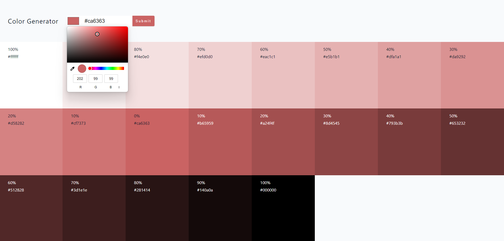

# Color Shades Generator

Welcome to the Color Shades Generator project! This web application allows you to generate a palette of 20 color shades based on a selected color. The shades include 10 darker shades and 10 brighter shades, providing you with a diverse range of colors for your design needs.

## Live Demo

You can try out the Color Shades Generator by visiting the [live demo](https://color-generator-rivki.netlify.app/).

## Features

- **Color Input:** Enter a color of your choice using hex format or the color picker.
- **Shade Generation:** Instantly generate 20 color shades, with 10 darker shades and 10 brighter shades.
- **Copy to Clipboard:** Easily copy the hex code of any shade to the clipboard with a single click.

## Technologies Used

- [React](https://reactjs.org/): A JavaScript library for building user interfaces.
- [Vite](https://vitejs.dev/): A fast React development environment that provides instant server start and optimized build.
- [react-toastify](https://github.com/fkhadra/react-toastify): A popular toast notification library for React.

## Usage

To use the Color Shades Generator, simply visit the [live demo](https://color-generator-rivki.netlify.app/), enter a color of your choice, and explore the generated shades. Copy the hex codes to use them in your projects.
